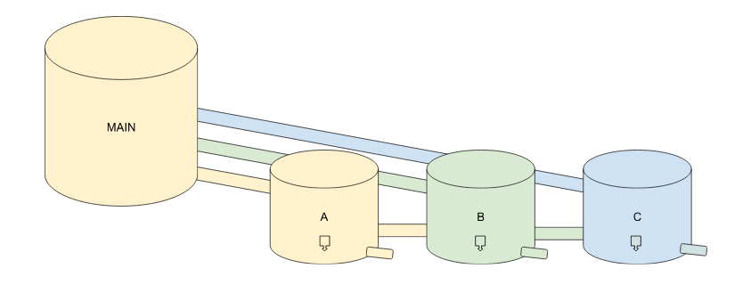
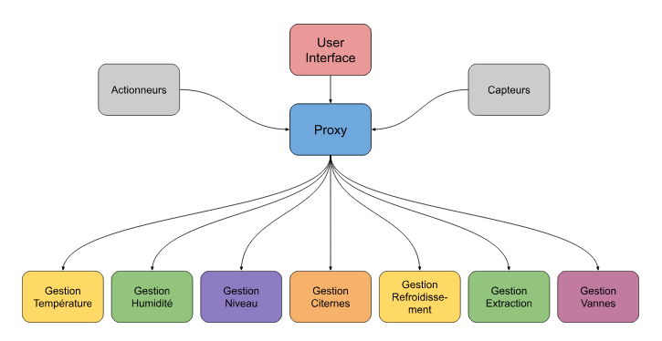
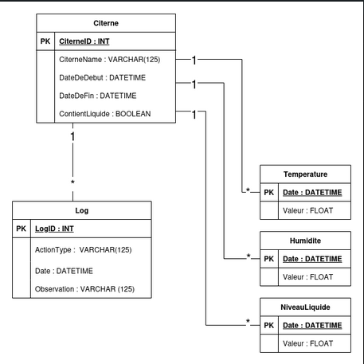
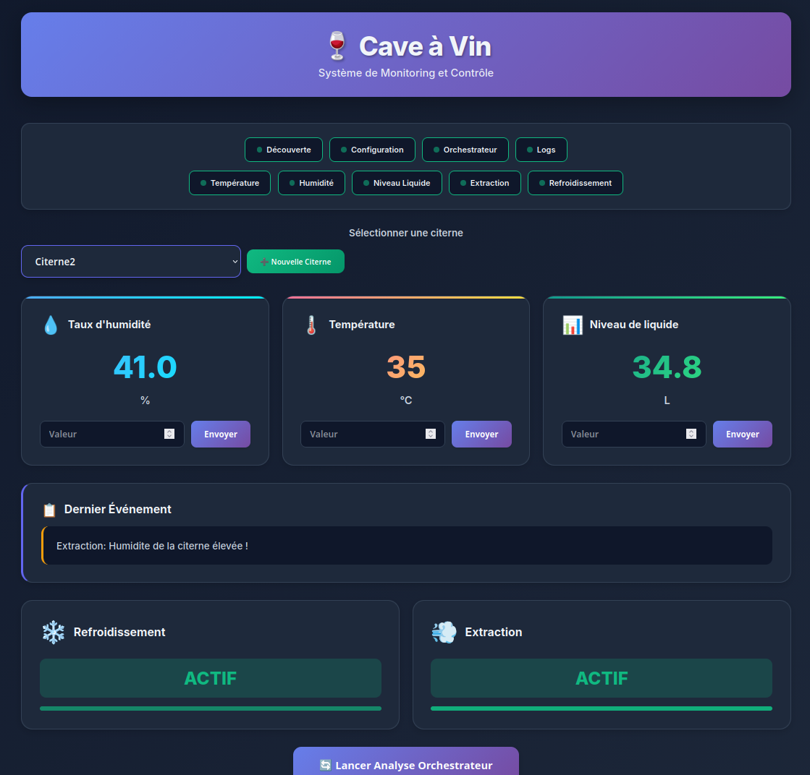

5ISS > Projet Architecture de service

# System de monitoring et control d'une cave à vin

Auteurs : Julie Revelli et Anya Meetoo
Tuteur : Prof. Nawal Guermouche

## Contexte

Le but de ce projet est de concevoir une architecture de service à base de microservice.

Notre projet à nous sera la gestion et l'automatisation d'une cave à vin. Nous avons plusieurs citernes contenant du vin et à l'aide de plusieurs capteurs on vient détecter plusieurs paramètres permettant de garder le vin dans les meilleurs conditions possible.

## Architecture physique



Nous avons :
- Une citerne main qui contient du raisin fraîchement pressé.
- Plusieurs citernes où le liquide  va rester longtemps pour devenir du vin 

Chaque citerne aura ses capteurs et ses actionnneurs.

### Monitoring / Capteurs

- Capteur de température : Pour vérifier si la température ne dépasse pas le niveau 
- Capteur d'humidité : Afin d'assurer une humidité convenable pour bien conserver le vin 
- Capteur de niveau : Donne le niveau des citernes

### Controlling / Actionneurs 

- Si la température dépasse le seuil on actionne un refroidissement (> 35C)
- Si l'humidité dépasse le seuile on fait une extraction (> 40%)

## Microservices et Bases de données associées 




## Démarrage - Exécution des Microservices

### Prérequis
- Java 21 ou supérieur
- Maven 3.6+

### Utiliser le script de démarrage automatique

Pour démarrer tous les microservices automatiquement en ordre avec un seul script :
```bash
./start-services.sh
```

Ce script :
- **Construit d'abord tous les packages** avec `mvn clean package` (automatique)
- Vérifie qu'il n'y a pas d'erreurs de compilation
- Démarre tous les services dans l'ordre avec des délais entre chaque
- Exécute chaque service en arrière-plan
- Crée des fichiers logs pour chaque service dans le dossier `logs/`
- Affiche le statut et les emplacements des fichiers logs
- Arrête tous les services quand vous appuyez sur **Ctrl+C**

**Avantage :** Un seul script pour tout faire - construction + démarrage des services !

## Interface Utilisateur

Une interface web moderne et responsive a été développée pour monitorer et contrôler les citernes de vin.



### Accès à l'interface

L'interface est accessible sur le port **8078** :
- URL: [http://localhost:8078](http://localhost:8078)

### Fonctionnalités

- **Monitoring en temps réel** : Affichage des valeurs actuelles de température, humidité et niveau de liquide
- **Contrôle des citernes** : Sélection de la citerne à surveiller via un menu déroulant
- **Ajout de mesures** : Possibilité d'ajouter manuellement des valeurs pour chaque capteur
- **Statut des services** : Visualisation de l'état de tous les microservices (actif/inactif)
- **Actions automatiques** : Affichage de l'état du refroidissement et de l'extraction
- **Derniers événements** : Consultation des derniers logs et observations
- **Orchestration** : Bouton pour lancer manuellement l'analyse de l'orchestrateur

### Design

L'interface utilise :
- Design moderne avec dégradés et animations fluides
- Thème sombre pour une meilleure lisibilité
- Interface responsive compatible mobile et desktop
- Icônes emoji pour une identification rapide
- Notifications toast pour les confirmations d'actions
- Rafraîchissement automatique des données toutes les 5 secondes

### Lancement du microservice Interface

```bash
cd Microservices/Interface
mvn spring-boot:run
```

Ou avec le script de démarrage automatique qui inclut désormais l'interface.

### Construire tous les microservices

Construire tous les microservices dans l'ordre :
```bash
mvn clean package
```

Installer tous les modules (y compris les dépendances) :
```bash
mvn clean install
```

### Mettre à jour les dépendances

Pour mettre à jour les dépendances de tous les projets :
```bash
mvn clean install -U
```

La flag `-U` force Maven à télécharger les dernières versions des dépendances depuis les dépôts.

### Exécuter des microservices individuels

Exécuter un microservice spécifique :
```bash
cd Microservices/<Nom_microservice>
mvn spring-boot:run
```

Remplacer par :
- `Configuration` - Service de configuration centralisée
- `Decouverte` - Service de découverte
- `Orchestrateur` - Service d'orchestration
- `Citernes` - Gestion des citernes
- `Temperature` - Surveillance de température
- `NiveauLiquide` - Surveillance du niveau de liquide
- `Humidite` - Surveillance de l'humidité
- `Log` - Service de journalisation
- `Refroidissement` - Contrôle de refroidissement
- `Extraction` - Contrôle d'extraction d'humidité

### Construire un module spécifique

Construire un seul microservice sans construire tous les autres :
```bash
mvn -pl Microservices/Configuration clean package
```

### Arrêter un microservice spécifique

Pour arrêter un microservice en cours d'exécution :

```bash
pkill -f "Microservices/<Nom_microservice>"
```

Ou si le service s'exécute via Maven :

```bash
cd Microservices/<Nom_microservice>
# Appuyer sur Ctrl+C dans le terminal où le service est en cours d'exécution
```

Pour arrêter tous les services à la fois :

```bash
./stop-services.sh
```


## API Endpoints

Voici la liste complète de tous les microservices avec leurs ports et endpoints :

### Configuration - Port 8888
Service de configuration centralisée pour tous les microservices.

### Decouverte - Port 8761
Service de découverte Eureka pour l'enregistrement et la localisation des microservices.

### Orchestrateur - Port 8079
Service d'orchestration principal qui coordonne les actions basées sur les mesures des capteurs.

- **GET** [localhost:8079/orchestrateur/decision/{citerneID}](http://localhost:8079/orchestrateur/decision/{citerneID})
  - Analyse les paramètres d'une citerne et déclenche les actions nécessaires

### Citernes - Port 8082
Gestion des citernes de vin.

- **GET** [localhost:8082/citernes/list](http://localhost:8082/citernes/list)
  - Liste toutes les citernes
- **GET** [localhost:8082/citernes/list/{id}](http://localhost:8082/citernes/list/{id})
  - Obtenir les informations d'une citerne spécifique
- **POST** [localhost:8082/citernes/add/{idCiterne}?citerneName={name}](http://localhost:8082/citernes/add/{idCiterne}?citerneName={name})
  - Ajouter une nouvelle citerne
- **DELETE** [localhost:8082/citernes/delete/{idCiterne}](http://localhost:8082/citernes/delete/{idCiterne})
  - Supprimer une citerne
- **PUT** [localhost:8082/citernes/updateliquide/{idCiterne}?contientLiquide={boolean}](http://localhost:8082/citernes/updateliquide/{idCiterne}?contientLiquide={boolean})
  - Mettre à jour le statut de présence de liquide

### Temperature - Port 8080
Surveillance de la température des citernes.

- **GET** [localhost:8080/temperature/list](http://localhost:8080/temperature/list)
  - Liste toutes les mesures de température
- **GET** [localhost:8080/temperature/last/{citerneID}](http://localhost:8080/temperature/last/{citerneID})
  - Obtenir la dernière température d'une citerne
- **POST** [localhost:8080/temperature/add?valeur={int}&citerneID={int}](http://localhost:8080/temperature/add?valeur={int}&citerneID={int})
  - Ajouter une nouvelle mesure de température

### NiveauLiquide - Port 8084
Surveillance du niveau de liquide dans les citernes.

- **GET** [localhost:8084/niveauliquide/list](http://localhost:8084/niveauliquide/list)
  - Liste toutes les mesures de niveau de liquide
- **GET** [localhost:8084/niveauliquide/last/{citerneID}](http://localhost:8084/niveauliquide/last/{citerneID})
  - Obtenir le dernier niveau de liquide d'une citerne
- **POST** [localhost:8084/niveauliquide/add?valeur={float}&citerneID={int}](http://localhost:8084/niveauliquide/add?valeur={float}&citerneID={int})
  - Ajouter une nouvelle mesure de niveau de liquide

### Humidite - Port 8085
Surveillance de l'humidité des citernes.

- **GET** [localhost:8085/humidite/list](http://localhost:8085/humidite/list)
  - Liste toutes les mesures d'humidité
- **GET** [localhost:8085/humidite/last/{citerneID}](http://localhost:8085/humidite/last/{citerneID})
  - Obtenir la dernière mesure d'humidité d'une citerne
- **POST** [localhost:8085/humidite/add?valeur={float}&citerneID={int}](http://localhost:8085/humidite/add?valeur={float}&citerneID={int})
  - Ajouter une nouvelle mesure d'humidité

### Log - Port 8083
Service de journalisation des événements et actions.

- **GET** [localhost:8083/log/list](http://localhost:8083/log/list)
  - Liste tous les logs
- **GET** [localhost:8083/log/list/{idCiterne}](http://localhost:8083/log/list/{idCiterne})
  - Obtenir les logs d'une citerne spécifique
- **POST** [localhost:8083/log/add](http://localhost:8083/log/add)
  - Ajouter un nouveau log (body: LogEntity JSON)

### Refroidissement - Port 8081
Contrôle du système de refroidissement.

- **POST** [localhost:8081/refroidissement/apply](http://localhost:8081/refroidissement/apply)
  - Activer/désactiver le refroidissement (body: Refroidissement JSON)
- **GET** [localhost:8081/refroidissement/state/{citerneID}](http://localhost:8081/refroidissement/state/{citerneID})
  - Obtenir l'état du refroidissement d'une citerne

### Extraction - Port 8086
Contrôle du système d'extraction d'humidité.

- **POST** [localhost:8086/extraction/apply](http://localhost:8086/extraction/apply)
  - Activer/désactiver l'extraction (body: Extraction JSON)
- **GET** [localhost:8086/extraction/state/{citerneID}](http://localhost:8086/extraction/state/{citerneID})
  - Obtenir l'état de l'extraction d'une citerne

## Conclusion